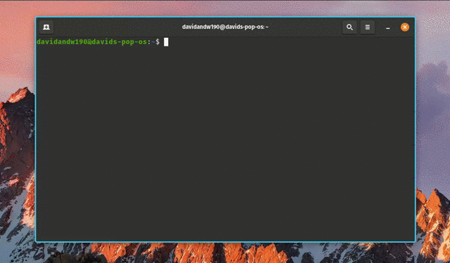

# CLI Todo App in Go

This project represents a simple but efficient CLI pplication written in Go, which allows you to manage your tasks through a simple and intuitive interface directly from your terminal. This is one of my first Go projects and it was initially inspired by the work of [Abah Joseph](https://github.com/joefazee). However, I've adopted quite a few distinct approaches and significantly expanded upon the initial concept.


## Setup

Before using the CLI todo app, you need to have Go installed on your system. You can download and install Go from the official [Go website](https://golang.org/dl/).


Once you have Go installed, you can build the project using the following steps:


1. Clone the repository:
```
git clone https://github.com/davidandw190/simple-todo-go.git
```

2. Navigate to the project directory and build the project:
```
cd todo && go build ./cmd/todo
```

3. Add the directory containing the executable to the system's PATH environment variable. I will showcase how to do it on LINUX, but it will work through other means on Windows too:
```
export PATH=$PATH:/full/path/to/the/program/here
```

## Usage 

The todo app currently supports the following functionalities:

### List Tasks
To list all tasks, run the following command:
```
todo -l
```

By default, all tasks are listed. You can use additional flags to customize the output:

- To show only completed tasks: `-sc or --completed`
- To show only the pending tasks: `-sp or --pending`

### Add Task
To add a new task, run the following command, and the CLI will prompt you for input:
```
todo -a
```

### Edit Task
To edit an existing task, run the following command and the CLI will prompt you for input:
```
todo -e <taskIndex>
```

### Complete Task
To mark a task as completed, run the following command:
```
todo -c <taskIndex>
```

### Delete Task
To delete an existing task, run the following command:
```
todo -d <taskIndex>
```

### Delete All Tasks
To delete all existing tasks, run the following command:
```
todo -da
```
